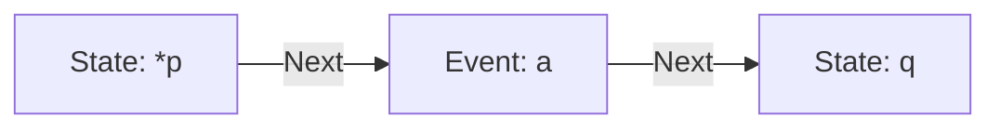
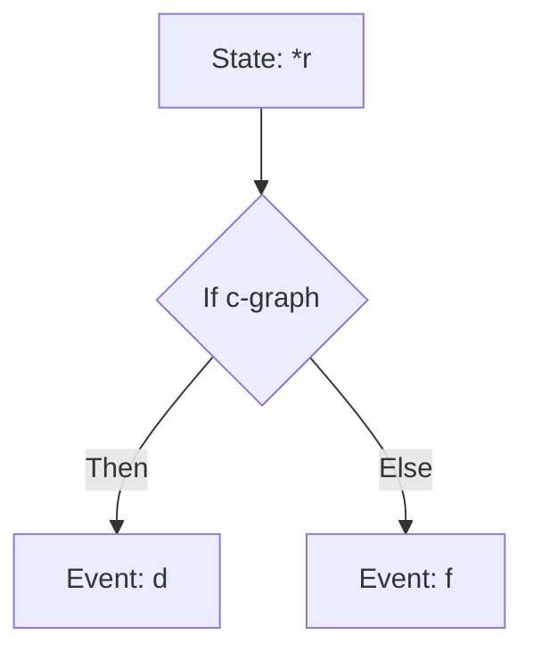
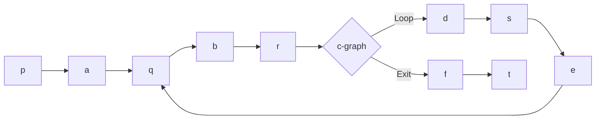
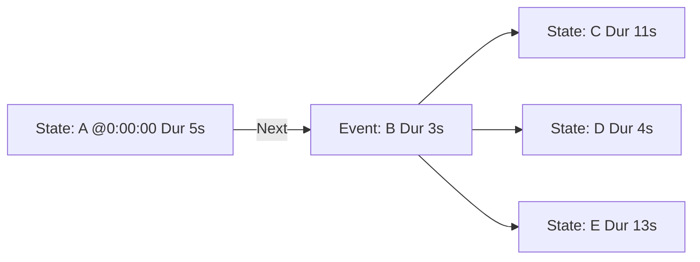

## Topics
- Processes: 
	- Times, Events and Situations
	- Classification of processes
	- Procedures, Processes and Histories
	- Concurrent processes
	- Computation
	- Constraint satisfaction
	- Change Contexts
		- Syntax of contexts
		- Semantics of contexts
		- First-order reasoning in contexts
		- Modal reasoning in contexts
		- Encapsulating objects in contexts.


# [[Times, Events, and Situations]]

### 1. **Time and Motion**
- St. Augustine questioned whether time is defined solely by celestial motion or if all movements (e.g., a potter's wheel) can constitute time.
- Time exists independently of heavenly bodies; even without stars, we could still measure time through other processes.

### 2. **Processes vs. Objects**
- Traditional logic focuses on **objects** and static relations (e.g., `stabbed(Brutus, Caesar)`).
- Modern logicians like **Peirce** and **Whitehead** emphasized **processes** as primary entities.
- Events and actions should be treated as first-class citizens in logical representations.

---

## Representing Events

### 3. **Event Semantics**
- **Donald Davidson** argued for treating events as quantifiable variables in logic.
- Example:
  ```plaintext
  (∃e:Event)(stab(e) ∧ agent(e, Brutus) ∧ patient(e, Caesar))
  ```
- This captures more detail than simple predicate logic, allowing for adverbs, instruments, and tense.

### 4. **Temporal Representation**
- **Terence Parsons** introduced event-based logic with temporal intervals:
  ```plaintext
  (∃I:Interval)(before(I, now) ∧ (∃t:Time)(t ∈ I) ∧ (∃e:Stabbing)(agent(e, Brutus) ∧ patient(e, Caesar) ∧ culminates(e, t)))
  ```

---

## Conceptual Graphs and Situations

### 5. **Conceptual Graphs (CGs)**
- Combine logic and semantic networks to represent both objects and processes.
- Use nodes and relations to model actions, participants, and modifiers.
- Example: "Brutus stabbed Caesar violently with a shiny knife"
![[Pasted image 20250515165359.png]]
#### Elements in CGs:
- **Agnt (Agent)**: Who performs the action.
- **Ptnt (Patient)**: The entity affected.
- **Inst (Instrument)**: Tools used.
- **Manr (Manner)**: How an action was performed.
- **Attr (Attribute)**: Properties of entities.

### 6. **Situations**
- A **Situation** concept encloses a set of events and their context.
- Tense and modality are modeled using indexicals and temporal relations.
- Example: Past tense is represented using:

![[Pasted image 20250515165425.png]]

---

## Indexicals and Context

### 7. **Indexicals**
- Words like “now,” “this,” “you” depend on context.
- In CGs, marked with `#` (e.g., `#now`, `#this`).
- Must be resolved to constants based on the utterance context during translation to predicate logic.

---

## Plurals, Distributive vs. Collective

### 8. **Distributive and Collective Interpretations**
- **Distributive (Dist)**: Each participant involved separately (e.g., Alma married three husbands at different times).
- **Collective (Col)**: All participants involved together (e.g., group singing).

#### Example:
- Distributive:
  ```plaintext
  [Husband: Dist{Gustav, Walter, Franz}@3]
  ```
- Collective:
  ```plaintext
  [Husband: Col{Gustav, Walter, Franz}@3]
  ```

- Moving past tense from verb to situation depends on whether the plural is distributive or collective.
![[Pasted image 20250515165542.png]]
---

## Adverbs and Manner

### 9. **Adverbial Modifiers**
- Adverbs often express **manner** of an action.
- In CGs, linked via **Manr** relation.
- Placement affects meaning:
  - “John sang strangely” → manner of singing.
  - “Strangely, John sang” → entire situation is strange.

#### Syntactic vs. Semantic Cues
- English uses `-ly` to distinguish adverbs from adjectives.
- Other languages rely purely on semantics to determine whether a modifier applies to the action or object.

---

## Actions as Roles

### 10. **Action Classification**
Actions can be described based on:
- **Form (Firstness)**: Observable behavior (e.g., walking).
- **Effects (Secondness)**: Outcome (e.g., disappearance).
- **Intentions (Thirdness)**: Purpose (e.g., hiding).

#### Example Verbs:
- **Walking** (form)
- **Disappearing** (effect)
- **Hiding** (intention)

### 11. **Multiple Descriptions of Same Action**
- The same action can be described differently depending on focus:
  - **Spent time**: duration
  - **Outlining**: result
  - **Speaking**: form

In conceptual graphs, these would be coreferenced but emphasize different aspects.

---

| Concept                 | Description                                                |
| ----------------------- | ---------------------------------------------------------- |
| **Event**               | First-class entity; includes agents, patients, instruments |
| **Tense**               | Modeled via temporal relations and indexicals              |
| **Situation**           | Encapsulates events and context                            |
| **Conceptual Graphs**   | Visual/logical tool for representing processes             |
| **Indexicals**          | Context-sensitive references like `#now`                   |
| **Plural Types**        | Distributive (one-by-one), Collective (together)           |
| **Adverbs**             | Represented via `Manr`; scope matters                      |
| **Action Perspectives** | Form, effect, intention                                    |
# [[Classification of Processes]]

Processes are classified based on their **starting/stopping points** and the nature of changes between these points. This section explores their categorization, temporal aspects, and key distinctions.

---

## Continuous vs. Discrete Processes
![[Pasted image 20250515165633.png]]
### Continuous Processes
- **Definition**: Incremental changes occur continuously (e.g., natural physical processes).
- **Subtypes**:
  - **Initiation**: Explicit starting point (e.g., beginning of rainfall).
  - **Continuation**: No endpoints considered (e.g., ongoing weather patterns).
  - **Cessation**: Explicit ending point (e.g., stopping a machine).
- **Symbols**:
  - Vertical bars (`|`): Endpoints or classification boundaries.
  - Wavy line (`~~~`): Continuous change.
  - Straight line (`---`): No change.

### Discrete Processes
- **Definition**: Changes occur in discrete **events** separated by inactive **states** (e.g., computer programs).
- **Structure**: Alternating states (straight lines) and events (wavy lines), e.g., `---|~~~|---|~~~|`.
- **Example**: A program executing step-by-step instructions.

---

## Role of Agent Intentions
Process classification can depend on **agent goals**:
- **Success**: Cessation aligns with goals (e.g., completing a task on time).
- **Failure**: Cessation contradicts goals (e.g., missing a deadline).

### Example: Farmer Brown
- **Scenario**: Plows east field Monday, west field Tuesday.
- **Classification**:
  - **Single success** if goal is completion in two days.
  - **Two successes** if fields are considered separately.
  - **Failure** if promised one-day completion.

---

## Language and Temporal Aspects
### Tense and Aspect
- **Tense**: Relates event time to speech time (past, present, future).
- **Aspect**: Describes initiation, continuation, or completion relative to reference times.
  - *"Plowed"* (past tense, completed aspect) vs. *"was plowing"* (past continuous).

### Verb Influence
- Verbs encode intentions, affecting process interpretation:
  - *"Finish"* implies successful cessation.
  - *"Abandon"* implies failure.

---

## Fluents
### Definition
- **Newtonian Fluents**: Time-dependent quantities (e.g., position, temperature).
- **AI Generalization**: State-dependent properties (e.g., "being president").

### Representation
- **Implicit (Temporal Logic)**: Operators like `□` (always) or `◇` (sometimes).
- **Explicit**: Time as an argument, e.g., `part(x, y, t)`.

### Example: Presidential Fluent
- **Syllogism Fallacy**:
  - Major premise: "The president is elected every 4 years."
  - Minor premise: "Clinton is president."
  - Conclusion: "Clinton is elected every 4 years."
- **Error**: Context-dependent indexical ("the president") misapplied across temporal scopes.

---

## Sandewall's Distinctions for Processes
Erik Sandewall’s framework categorizes processes by complexity:

| **Distinction**          | **Options**                                                                 |
|--------------------------|-----------------------------------------------------------------------------|
| **Discrete vs. Continuous** | Approximated via time steps vs. differential equations.                     |
| **Linear vs. Branching**    | Deterministic vs. nondeterministic future paths.                            |
| **Independent vs. Ramified** | No side effects vs. cascading changes (local/structural).                   |
| **Immediate vs. Delayed**   | Instantaneous effects vs. lagged outcomes.                                  |
| **Sequential vs. Concurrent** | Single vs. parallel events.                                                |
| **Predictable vs. Surprising** | Scripted vs. exogenous events.                                            |
| **Normal vs. Equinormal**    | Default outcomes vs. equally likely alternatives.                          |
| **Flat vs. Hierarchical**    | Simple events vs. nested subevents (recursive possible).                   |
| **Timeless vs. Time-bound**  | Fixed objects vs. dynamic creation/destruction.                           |
| **Forgetful vs. Memory-bound** | Markovian (current state only) vs. history-dependent.                     |

### Implications
- **2304 Categories**: Combinations of 10 distinctions (2⁸ × 3²).
- **Real-World Complexity**: Most natural processes involve branching, ramified, concurrent, and memory-bound traits.


# [[Procedures, Processes, and Histories]]

## Discrete vs. Continuous Process Simulation
- **Digital Computers**: Simulate discrete processes via state transitions (e.g., finite-state machines, Petri nets).
- **Analog Computers**: Naturally simulate continuous processes (e.g., differential equations).
- **Approximation**: Discrete steps (e.g., movie frames) can mimic continuity with small time granularity.

---

## Representing Discrete Processes
![[Pasted image 20250515170649.png]]


| **Notation**          | **Components**                          | **Use Case**                     |
|-----------------------|----------------------------------------|----------------------------------|
| **Flow Charts**       | Boxes (events), Diamonds (decisions)   | Procedural programming (von Neumann). |
| **Finite-State Machines** | Circles (states), Arcs (transitions) | Simple sequential processes.     |
| **Petri Nets**        | Places (circles, states), Transitions (bars) | Concurrent processes (UML activity diagrams). |

**Key Feature**: Petri nets unify flow charts and finite-state machines, enabling causal representation:
- **Transition Inputs**: Causes (preconditions).
- **Transition Outputs**: Effects (postconditions).

---

## Mapping to Logic
![[Pasted image 20250515170721.png]]

**CG Structure**:

- **Nested Graphs**: Describe states/events (e.g., `dscr(p, φ(p-graph))`).
- **Predicate Calculus Translation**:
  ```logic
  (∃p:State)(∃a:Event)(∃q:State) (
    dscr(p, φ(p-graph)) ∧ next(p,a) ∧ 
    dscr(a, φ(a-graph)) ∧ next(a,q) ∧ 
    dscr(q, φ(q-graph))
  ```

---

## Procedures vs. Processes vs. Histories
| **Type**       | **Definition**                          | **Logical Quantifiers**          | **Example**                     |
|----------------|----------------------------------------|----------------------------------|----------------------------------|
| **Procedure**  | Pattern for process family (script).   | Universal (`∀`).                 | Petri net *without* tokens.      |
| **Process**    | Active sequence (current state = `#now`). | Indexicals (e.g., `#now`).      | Token moving through Petri net.  |
| **History**    | Record of past states/events.          | Existential (`∃`), timestamps.   | Log of token path with durations. |

![[Pasted image 20250515170744.png]]

- **Procedure**: `[State: ∀p] → [Event: a] → [State: q]`.
- **Process**: `[State: p @#now] → [Event: a] → [State: q]`.
- **History**: `[State: p (Dur: 5 sec)] → [Event: a @t1] → [State: q]`.

---

## Branches and Loops in Logic
### Branches (Conditionals)
**CG Representation**:

**Predicate Calculus**:
```logic
(∃r:State)(
  dscr(r, φ(r-graph)) ∧ 
  (dscr(r, φ(c-graph)) ∧ next(r,d)) ∨ 
  (¬dscr(r, φ(c-graph)) ∧ next(r,f))
```

### Loops (Recursion)
**CG Macro (While Loop)**:

**Recursive Logic**:

```logic
Loopl ≡ (λe:Event)(
  ∃d...r (dscr(d, φ(d-graph)) ∧ ... ∧ 
  (dscr(r, φ(c-graph)) ⊃ next(r, Loopl)))
```

---

## Procedural vs. Declarative
| **Aspect**       | **Procedural (Code)**          | **Declarative (Logic)**          |
|------------------|--------------------------------|----------------------------------|
| **Sequence**     | Implicit (line order).         | Explicit (`next` relations).     |
| **Branching**    | `if-else` syntax.              | `∨` with negated conditions.     |
| **Loops**        | `while/for` constructs.        | Recursive predicates/macros.     |

**Ideal**: Use intuitive notation (e.g., Petri nets), compile to logic for analysis or machine code for execution.


# [[Concurrent Processes]]

## Petri Nets for Concurrency
- **Strength**: Represent parallel processes (unlike sequential flowcharts/FSMs).  
- **Tokens**: Generalize semantic network markers (Quillian, Fahlman).  

![[Pasted image 20250515171422.png]]
- **Tokens**:  
  - 3 in `People waiting` (passengers).  
  - 1 in `Bus arriving` (bus token).  
- **Transitions**:  
  - `Bus stops`: Moves bus token to `Bus waiting`.  
  - `One person gets on`: Consumes 1 passenger + bus token → outputs `People on bus` + returns bus to `Bus waiting`.  
  - `Bus starts`: Moves bus to `Bus leaving`.  

**Key Insight**:  
- **Concurrency**: Multiple passengers can board simultaneously (if tokens allow).  
- **Limitation**: Simplified model (no "thoughtful driver" logic).  

---

## Colored Petri Nets
- **Tokens carry data** (e.g., resource type, task details).  
- **Applications**:  
  - **PERT Charts**: Acyclic nets for project management (tasks = transitions, dependencies = arcs).  
  - **Typed Logic**: Colors map to CG/predicate calculus types (e.g., `[Task: Design]`).  

---

## Token Flow Rules  
![[Pasted image 20250515171507.png]]  **Rules**:  
1. **Enabled**: All input places have tokens.  
2. **Active**: Tokens removed from inputs.  
3. **Finished**: Tokens added to outputs.  

**Example**:  
- At `t=0`: Token in `a` → enables transition `b`.  
- At `t=8`: `b` fires → tokens in `c`, `d`, `e`.  

**CG Representation**:  


---

## Timing Diagrams  
![[Pasted image 20250515171544.png]]
- **States**: Straight lines (`A`, `C`, `D`, `E`).  
- **Events**: Wavy lines (`B`, `F`, `G`, etc.).  
- **Critical Path**: Longest duration path (no waits).  

**Example**:  
- `A` (0–5s) → `B` (5–8s) → `C` (8–19s) → `F` (19–22s).  
- Parallel threads: `D` → `G`/`K`, `E` → `H`/`J`.  

---

## Time Measurement  
![[Pasted image 20250515171610.png]]
- **Tick Transition**: Adds tokens to `Time` place (counts ticks).  
- **Counters**:  
  - **1-bit counter** (Figure 4.11): Toggles `even`/`odd` + `carry`.  
  - **n-bit counter**: Chains 1-bit counters (max count = `2^n`).  

**Principle**: Time is measured by counting repetitive events (e.g., pendulum swings).  

---

## Synchronization (Semaphores)  
![[Pasted image 20250515171637.png]]

- **Producers (2 tokens)**: Generate messages → require `Buffer Empty`.  
- **Consumer (1 token)**: Reads messages → requires `Buffer Full`.  
- **Semaphores**:  
  - **P (Pass)**: Requests resource (`s > 0 ? s-- : wait`).  
  - **V (Free)**: Releases resource (`s++`).  

**Deadlock Avoidance**:  
- Ensure `#inputs = #outputs` per transition (constant token count).  
- Balance forks (`n-way split`) with joins (`n-way merge`).  

---

## Petri Net Theorems  
| **Theorem**                          | **Implication**                                  | **Example**                     |
|--------------------------------------|-------------------------------------------------|----------------------------------|
| **Token Gain/Loss**                  | Net tokens change by `(m - n)` per firing.      | Fork `b` in Fig 4.8: `+2`.      |
| **Constant Tokens**                  | `#inputs = #outputs` → token count stable.      | Flowcharts (1-in, 1-out).       |
| **Cycle Stability**                  | Cycles with 1-in/1-out per place fix token count. | Producer loop in Fig 4.12: 2 tokens. |

**Memory Leaks**: Dormant tokens (e.g., stuck in `j` in Fig 4.9) → design joins to reclaim resources.  

# 4.5 [[Computation]]

## Declarative vs. Directional Computation
- **Declarative Notations** (logic, math): Relationships are bidirectional (e.g., `F = ma` can solve for any variable).  
- **Computation**: Goal-directed (e.g., solve for `F` given `m` and `a`).  

**Example**:  
- **Logical Implication**:  
  ```logic
  ∀x,y:Note ((simul(x,y) ∧ tone(x,Ti) ∧ tone(y,Fa)) → 
              ∃z,w:Note (next(x,z) ∧ tone(z,Do) ∧ next(y,w) ∧ tone(w,Mi)))
  ```
  - **Forward Chaining**: Resolve dissonance → harmony.  
  - **Backward Chaining**: Plan harmony first, then introduce dissonance.  

**Analogy**: Logic is a road map; computation chooses the route.  

---

## Dataflow Diagrams
![[Pasted image 20250516165247.png]]
- **Functional Nodes**: Diamonds (e.g., `Sum`, `Prod`, `CS2N`).  
- **Inputs/Outputs**:  
  - `Sum(?a, ?b, *x)` → `x = a + b`.  
  - `Prod(Sum(...), CS2N(?c), *y)` → `y = (a + b) * cs2n(c)`.  

**Key Constraint**:  
- **Single Assignment**: Variables immutable after initialization (no `x = x + 1`).  

### Functional Programming Primitives:  
1. **Recursion** (e.g., factorial).  
2. **Function Application**.  
3. **Conditionals**.  

![[Pasted image 20250516165308.png]]
**Translations**:  
- **Predicate Calculus**:  
  ```logic
  facto = λn:Integer (cond(2 > n, 1, n * facto(n-1)))
  ```
- **C**:  
  ```c
  int facto(int n) { return (2 > n) ? 1 : n * facto(n-1); }
  ```
- **LISP**:  
  ```lisp
  (defun facto (n) (if (> 2 n) 1 (* n (facto (sub1 n))))
  ```

---

## Petri Nets for Computation
- **Dataflow → Petri Net**:  
  - Concepts → Places.  
  - Relations → Transitions.  
- **Recursion**: Dynamically expands/collapses (stack-like).  

**Jensen’s Approach**:  
- **Functional ML**: Specifies transitions.  
- **Petri Nets**: Manages concurrency.  
- **Compiled to C**: For efficiency.  

**Applications**:  
- Radar simulation, banking transactions, telecom protocols.  

---

## Message Passing Paradigms
### Communication Types:  
| **Sync/Async** | **Addressed**               | **Associative (BB)**          |  
|----------------|-----------------------------|-------------------------------|  
| **Synchronous** | Subroutine calls (blocking). | CLIPS agenda (forward chaining). |  
| **Asynchronous**| Multithreading (non-blocking). | Stock exchange (Linda, InfoBus). |  

### Linda Model (Asynchronous Associative):  
- **Bulletin Board (BB)**: Shared tuple space.  
- **Tuple Types**:  
  1. **Data**: `(objects B pyramid green)`.  
  2. **Patterns**: `(objects ?name ?shape green)`.  
  3. **Executable**: `(eval (facto 5))` → Spawns process.  

![[Pasted image 20250516165340.png]]
- **In/Read**: Block until match.  
- **InP/ReadP**: Non-blocking (return `null` if no match).  
- **Out**: Post data to BB.  
- **Eval**: Evaluate expressions in parallel.  

**Example**:  
```lisp
; Query BB for green object
(inP (objects ?name ?shape green)) → ("B" "pyramid")
```

**SQL Parallel**: Databases act as BB with concurrent queries.  

---
# 4.6 [[Constraint Satisfaction]]

## Generate-and-Test Method
- **Unoptimized Approach**:  
  - **Generate**: Exhaustively assigns values to variables (e.g., nested loops).  
  - **Test**: Checks all constraints (exponential time complexity).  
- **Example**: Cryptarithmetic puzzle `SEND + MORE = MONEY`.  
  - **Variables**: `S, E, N, D, M, O, R, Y` + carries (`C1–C4`).  
  - **Constraints**:  
    ```plaintext
    D + E = Y + 10*C1  
    N + R + C1 = E + 10*C2  
    E + O + C2 = N + 10*C3  
    S + M + C3 = O + 10*C4  
    C4 = M  
    S,M > 0; all digits unique.
    ```

![[Pasted image 20250516165401.png]]

- **Weakness**: Inefficient (13 sec for unoptimized Prolog).  

---

## Constraint Propagation
### Optimization Principles:  
1. **Early Testing**: Apply constraints as soon as all their variables are assigned.  
2. **Minimize Choice Space**: Prioritize constraints with the smallest `choice(x1) * ... * choice(xn)`.  

### Optimized Steps for `SEND + MORE = MONEY`:  
1. **Determine `M` and `C4`**:  
   - `C4 = M` (choice space = 2 → `M=1`, `C4=1`).  
2. **Solve `S + M + C3 = O + 10*C4`**:  
   - `C3 ∈ {0,1}`, `S ∈ {2..9}` (choice space = 16).  
   - Compute `O = S + 1 + C3 - 10`.  
3. **Solve `E + O + C2 = N + 10*C3`**:  
   - `C2 ∈ {0,1}`, `E ∈ remaining digits` (choice space = 14).  
   - Compute `N = E + O + C2 - 10*C3`.  
4. **Solve `N + R + C1 = E + 10*C2`**:  
   - `C1 ∈ {0,1}` (choice space = 2).  
   - Compute `R = 10*C2 + E - N - C1`.  
5. **Solve `D + E = Y + 10*C1`**:  
   - Assign `D`, compute `Y = D + E - 10*C1`.  

![[Pasted image 20250516165424.png]]
- **Result**: 4 ms (3200x speedup).  

---

## Key Insights
- **Separation of Concerns**: Break monolithic generate/test into smaller steps.  
- **Deterministic Reductions**: Leverage constraints to compute values directly (e.g., `M=1`).  
- **Heuristics**: Use choice space metrics to guide variable assignment order.  

### Metalavel Techniques
| **Method**          | **Guarantees Optimal Solution?** | **Use Case**                     |  
|----------------------|----------------------------------|----------------------------------|  
| **Generate-and-Test** | Yes (exhaustive)                | Small problems.                  |  
| **Constraint Propagation** | Yes (reordered)             | Medium/large problems.           |  
| **Heuristics (e.g., genetic algorithms)** | No (approximate)       | Intractable problems.            |  

**Peirce’s Abduction**: Guess solutions → verify deductively (e.g., AI planning).  

--- 

## Applications
- **SQL Query Optimization**: Reorder joins based on constraint selectivity.  
- **Circuit Design**: Satisfy timing/power constraints via propagation.  
- **Scheduling**: Allocate resources under precedence rules.  

# 4.7 [[Change]]

## Reasoning About Change
- **Core Challenge**: Determining which facts persist or change across situations (e.g., `s₁ → s₂`).  
- **Representation Impact**: Choice of formalism (e.g., situation calculus, Petri nets) affects reasoning tractability.  

---

## Situation Calculus
### McCarthy’s Original Formulation (1963):
- **Fluent**: `cause(n)(s)` → Situation `s` leads to a future state satisfying `n`.  
  **Example**:  
  ```logic
  ∀s:Situation ∀p:Person [(raining ∧ outside(p)) ⊃ cause(wet(p))](s).
  ```
- **CG Translation**:  
  ```
      S[Situation: ∀*s] -->|∀p:Person| P[raining ∧ outside(p) ⊃ cause(s, wet(p))]
  ```

### Green’s First-Order Adaptation:
- **Explicit Situations**: Embed time in predicates (avoids fluents but causes frame problem).  
  ```logic
  ∀s,p [(raining(s) ∧ outside(p,s)) ⊃ getWet(p,s)].
  ```
- **Frame Problem**: Proliferation of axioms to state what *doesn’t* change (e.g., `inside(p,s) ⊃ ¬getWet(p,s)`).  

---
## Solving the Frame Problem
### STRIPS (Fikes & Nilsson, 1971):
- **Two-Level Approach**:  
  1. **Object Level**: EC logic for world models (e.g., `atRobot(m)`).  
  2. **Meta Level**: LISP procedures to copy/modify models (avoids redundancy).  
- **Action Template**:  
  ```plaintext
  push(k,m,n):
    Pre: atRobot(m) ∧ at(k,m)
    Delete: atRobot(m), at(k,m)
    Add: atRobot(n), at(k,n)
  ```
- **Key Insight**: Copy-then-modify enforces Leibniz’s principle ("only change what’s specified").  

### Yale Shooting Problem:
- **Indeterminacy**: Situation calculus cannot resolve disjunctions (e.g., did the gun unload or misfire?).  
- **Petri Net Solution**:  
![[Pasted image 20250516165525.png]]
  - **Distributed Causality**: Tracks states of gun, victim, and assassin independently.  
  - **Outcomes**:  
    ```plaintext
    Misfire ∨ Victim-dead  (disjunction without probabilities)
    P(Victim-dead) ≈ (1-ε₁)(1-ε₂)(1-ε₃)  (with belief networks)
    ```

---

## Causal Networks
| **Approach**       | **Key Feature**                          | **Example**                     |
|---------------------|-----------------------------------------|----------------------------------|
| **Rieger’s Nets**   | Natural language → causal links.        | "Loading gun enables firing."    |
| **Kuipers’ QR**     | Qualitative physics (no exact numbers). | "More pressure → higher flow."   |
| **Pearl’s Belief Nets** | Probabilistic causality.            | `P(misfire | loaded) = ε₃`.      |

**Linear Logic**: Executable proofs mimic Petri net transitions (decidable for nets).  

---